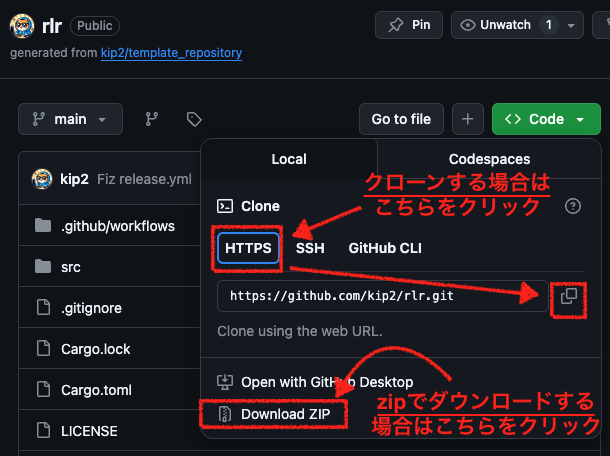

<h1 align="center">
  <strong style="font-size:2em;">rlr</strong>
</h1>
<h4 align="center">Recursion Local Runner</h4>

---

rlr(Recursion Local Runner)は、RecursionCSで公開されている問題を、ローカル環境で実行するためのツールです。

### 特徴

以下の特徴があります。

- ReucsionCSから、問題のテストケースをローカルに取得する。
- 指定されたコマンドで、取得したテストケースのローカルジャッジを実行する。
- ローカルで実行できるので、RecusrionCSのエディタでサポートされていない言語でも問題を解くことが可能。

また、ローカルで実行できるため、好きなエディタで編集、実行が可能となっています。
(`vim`、`neovim`、`Emacs`、`VScode`, `Eclipse`, `IntelliJ`, `サクラエディタ`, `秀丸エディタ`, `メモ帳`, ...and more)

## Install

Releaseからダウンロードして、配置して下さい。
また、PATHを通して下さい。

### Macの場合

#### インストール

インストールで必要な作業は2つです。

1. ファイルの取得
2. インストールの実行

##### ファイルの取得(Windows/Mac/Linux共通)

Gitリポジトリをクローン、もしくは`zip`でダウンロードして下さい。



`zip`でダウンロードの場合は、画像の様に、`Download ZIP`をクリックして下さい。
ファイルがローカルに保存されますので、ファイルを解凍して下さい。

ローカルに`git`コマンドがインストールされている場合は、以下の様にクローンすることでもファイルを取得できます。
こちらは`zip`圧縮されていないので、解凍の必要はありません。

```sh
git clone https://github.com/kip2/rlr.git
```


##### インストールの実行

インストール方法は、プラットフォームにより差があります。

##### Mac/Linuxの場合

実行権限を与えて、`install.sh`を実行して下さい。

```sh
# 実行権限の付与
chmod +x install.sh

# インストールの実行
./install.sh
# もしくはbashで起動する
bash install.sh
```

インストールの確認として、バージョン情報の出力を確認して下さい。

```sh
# オプションのVは大文字なことに注意する
rlr -V

# もしくは
rlr --version
```

##### windowsの場合

コマンドプロンプト(`cmd`)、もしくはPowerShellでディレクトリを開き、 `install.bat`を実行して下さい。

```cmd
install.bat
```

インストールの確認として、バージョン情報の出力を確認して下さい。

```sh
# オプションのVは大文字なことに注意する
rlr -V

# もしくは
rlr --version
```

#### アンインストール

#### Mac/Linuxの場合

`uninstall.sh`に実行権限を与えたあと、実行して下さい。

```sh
# 実行権限の付与
chmod +x uninstal.sh

# uninstallの実行
./uninstall.sh

# もしくは
bash uninstall.sh
```

#### Windowsの場合

コマンドプロンプト(`cmd`)、もしくはPowerShellでディレクトリを開き、 `uninstall.bat`を実行して下さい。

```cmd
uninstall.bat
```

## Usage

`rlr`を使用するには、以下の手順が必要です。

1. RecursionCSへの初回ログインを実施する(`login`コマンド)。
2. RecursionCSから問題のテストケースをダウンロードする(`download`コマンド)。
3. 問題を解くコードを、好きなエディタで書く。
4. 3で書いたコードで、問題が解けるかのジャッジを実行する。

### 初回ログイン

RecursionCSは会員制サイトです。
そのため、テストケース取得のためにログインを実施する必要があります。
以下のようにログインコマンドを実施して下さい。

```sh
rlr login 

# もしくは
rlr l
```

### テストケースのダウンロード

次に、問題ページのテストケースをダウンロードします。

ダウンロードしたい問題ページを開き、URLを確認、もしくはコピーして以下のコマンドを実行して下さい。

```sh
rlr download "https://recursionist.io/dashboard/problems/1"

# もしくは
rlr d "https://recursionist.io/dashboard/problems/1"
```

以下の様にダウンロードされます。

```sh
└── problem-1
    └── testcase
        ├── testcase-1.in
        ├── testcase-1.out
        ├── testcase-2.in
        ├── testcase-2.out
        ├── testcase-3.in
        ├── testcase-3.out
        ├── testcase-4.in
        ├── testcase-4.out
        ├── testcase-5.in
        └── testcase-5.out
```

### 問題を解くコードを好きなエディタで記載する。

好きなエディタを用いて問題を解くコードを記載して下さい。

その際の注意事項等については[問題の解き方](./document/問題の解き方.md)を参照して下さい。

### ジャッジを行う

ジャッジを行うには`judge`コマンドを使用して下さい。

`judege`コマンドは以下のような構造になっています。

```sh
# <command>はシェルで実行可能なコマンドを実行して下さい。
rlr judge "<command>"
```

#### 指定できるcommandについて

指定できるコマンドは、シェルやコマンドプロンプトで実行できるコマンドを指定して下さい。

例えば、`python`コードを`main.py`に記載した場合は、以下のような`command`を指定して下さい。


```sh
# pythonの例。main.pyの実行を行う。
rlr judge "python3 main.py"
```

> **NOTE:** 指定する`command`は必ず文字列である必要があります。`""`で囲って下さい。

> **NOTE:** `rlr`は、`input`となるテストケースを標準入力で受け取り、`judge`で指定した`command`に対してパイプ処理で受け渡して処理した後、標準出力を`output`のケースと比較します。
> つまり、標準入力を受け取って出力できる形での実行`command`なら何でも使えます。
> 手元で実行ができるならどんな言語でも使えます。

処理が実行され、各テストケースの結果が表示されます。

### その他

コマンドを忘れたら、`help`コマンドを実行して下さい。
他のコマンドと違って、`-`が頭につくことに注意して下さい。

```sh
rlr -h

# 詳細なhelp
rlr --help
```

## ご協力のお願い

当リポジトリは、皆さんからのフィードバックをお待ちしています。

ドキュメント整備、各言語での実行シェルスクリプト、実行方法など、やる作業は満載です。
気軽にPRやissueを投げて下さい。
PRやGithubの練習になると思いますので、どうぞお気軽に投げて下さい。

特に、各言語でのローカル実行の方法は、数が多いので皆さんの好きな言語で環境を構築してPRを投げて下さい。
手元で実行さえできればどんなマイナーな言語でも大丈夫です。

PRの投げ方についてはdocument内に記載していますので、参照して下さい。

[PRの投げ方](./document/usage/README.md)

## Special Thanks

`rlr`は [oj](https://github.com/online-judge-tools/oj) に、インスパイアされて作成しています。

## License

This project is licensed under the MIT License.